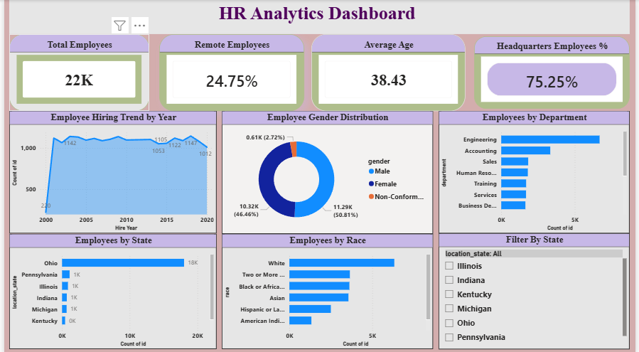

# HR Analytics Dashboard

## Project Overview

The HR Analytics Dashboard is a Power BI solution designed to analyze workforce data, employee demographics, hiring trends, and organizational performance through interactive visualizations and KPI monitoring.

## Business Problem

Human Resource departments require data-driven insights to understand workforce composition, monitor hiring patterns, evaluate employee distribution, and support strategic workforce planning.

## Objectives

- Analyze workforce demographics.
- Monitor employee hiring trends.
- Evaluate department-wise employee distribution.
- Track workforce diversity metrics.
- Support HR decision-making.

## Tools & Technologies

- Power BI
- DAX
- Power Query
- Data Modeling
- Data Visualization
- Microsoft Excel

## Dashboard Features

- Employee Overview
- Hiring Trend Analysis
- Gender Distribution
- Department Analysis
- State-wise Employee Distribution
- Workforce Diversity Analysis
- Interactive Filters

## Project Files

- HR_Analytics_Dashboard.pbix
- HR_Analytics_Report.docx
- HR_Analytics_Report.pdf
- HR_Analytics_Presentation.pptx

## Dashboard Preview

## Key Insights

- Analyzed workforce demographics and diversity.
- Evaluated hiring trends across multiple years.
- Identified department-wise employee distribution.
- Monitored workforce performance metrics.
- Supported strategic HR planning through data-driven insights.

## Business Impact

The dashboard provides HR teams with actionable insights for workforce planning, talent management, employee analysis, and organizational decision-making.

## Skills Demonstrated

- Data Cleaning
- Data Transformation
- Data Modeling
- DAX Calculations
- KPI Development
- Dashboard Design
- Business Intelligence
- Data Visualization
